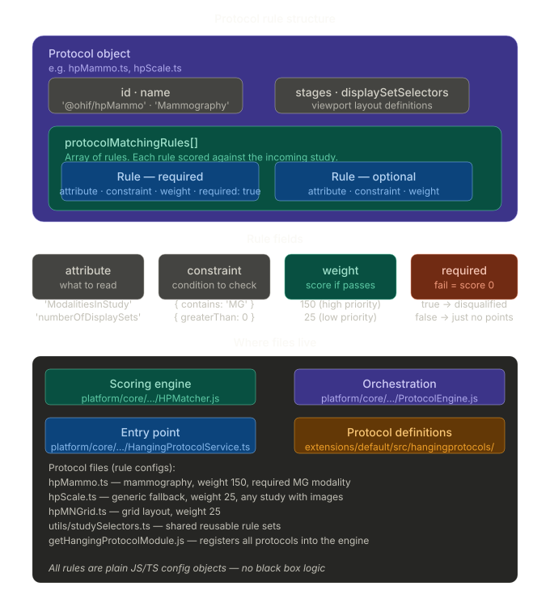

# OHIF Hanging Protocol — Weight-Based Scoring System

## Overview

When a radiologist opens a patient study, OHIF automatically selects the best display layout (**hanging protocol**) for it. The protocol selection system scores all registered protocols against the incoming study and picks the highest scoring one. The radiologist doesn't configure anything — the correct layout loads automatically.

The scoring system is straightforward: every protocol has a list of rules, each rule has a weight, and the protocol whose rules best match the study wins.

---

## Diagram 1 — Protocol Selection Flow



When a study loads, `HangingProtocolService.run()` is triggered. It creates a `ProtocolEngine` which iterates every registered protocol and scores each one via `HPMatcher.match()`. The highest scoring protocol is applied via `_setProtocol()`.

---

## Diagram 2 — Rule Structure



Each protocol is a plain JS/TS config object with a `protocolMatchingRules` array. Each rule has four fields:

| Field | Purpose | Example |
|---|---|---|
| `attribute` | What to read from the study | `'ModalitiesInStudy'` |
| `constraint` | Condition to check | `{ contains: 'MG' }` |
| `weight` | Score added if rule passes | `150` |
| `required` | If `true`, fail = score zeroed | `true` |

The weight math in `HPMatcher.js:93` is a single line in the function match() beginning at line 12:
```js
score += parseInt(rule.weight || 1, 10)
```

If a rule is marked `required: true` and it fails, the protocol's total score is set to **0** — it is fully disqualified regardless of other rules passing.

---

## Diagram 3 — Concrete Example (Mammography Study)



A mammography study loads with `ModalitiesInStudy: ['MG']` and 4 display sets.

**hpMammo** scores:
- Rule 1 (required): ModalitiesInStudy contains `'MG'` → passes → **+150**
- Rule 2 (required): numberOfDisplaySets > 2 → passes → **+1**
- **Total: 151**

**hpScale** (generic fallback) scores:
- Rule 1: numberOfDisplaySets > 0 → passes → **+25**
- **Total: 25**

**hpMammo wins (151 > 25)** → mammography layout applied.

If the study were a chest CT (no MG modality), hpMammo's required rule would fail → score zeroed → hpScale wins by default with score 25.

---

## Key Files

| File | Role |
|---|---|
| `platform/core/src/services/HangingProtocolService/HangingProtocolService.ts` | Entry point — `run()` at line 422 |
| `platform/core/src/services/HangingProtocolService/ProtocolEngine.js` | Orchestrates scoring, picks winner |
| `platform/core/src/services/HangingProtocolService/HPMatcher.js` | Weight math — `score += parseInt(rule.weight \|\| 1, 10)` at line 93 |
| `platform/core/src/services/HangingProtocolService/lib/sortByScore.js` | Sorts protocols by score descending |
| `extensions/default/src/hangingprotocols/hpMammo.ts` | Mammography protocol — weight 150, required MG modality |
| `extensions/default/src/hangingprotocols/hpScale.ts` | Generic fallback — weight 25, any study with images |
| `extensions/default/src/hangingprotocols/hpMNGrid.ts` | Grid layout protocol — weight 25 |
| `extensions/default/src/hangingprotocols/utils/studySelectors.ts` | Shared reusable rule sets |
| `extensions/default/src/getHangingProtocolModule.js` | Registers all protocols into the engine |

